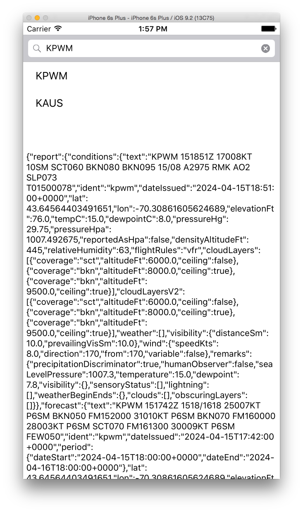

# ForeFlightCodingExercise
An iOS app that fetches and displays the weather report for a given airport from ForeFlight's QA server.

## How long was spent on the project

Started 9:00am Monday April 15th. Setting up my dev environment including installing OS X Yosemite v10.10.15 and Xcode v7.2 took until 10:30am. I then developed the app until 2:00pm the same day before leaving for work.

## Any notable design decisions you wish to highlight

I kept the UI very basic as I developed comprised of the following in top-to-bottom order:
- Search Bar: An affordance for the user to search for particular airports.
- Table View: A collection of the user's searches, keeping the most recent at the top.
- Text View: The JSON returned from calling upon "https://qa.foreflight.com/weather/report/" with the user defined airport from the search bar.

## Any references consulted and/or third party libraries used

### https://www.toptal.com/developers/gitignore/

Used to produce the .gitignore file.

### https://www.shrikar.com/blog/swift-ios-tutorial-uisearchbar-and-uisearchbardelegate

Tutorial referenced to generate a search bar and table view with filtering search.

### https://developer.apple.com/documentation/uikit/uisearchbar & https://developer.apple.com/documentation/uikit/views_and_controls/table_views

Apple docs referenced for better understanding `UISearchBar` and table views.

### https://developer.apple.com/documentation/foundation/nsmutableurlrequest

Apple docs for generating a URL request pre Swift 3.

### https://stackoverflow.com/questions/28302019/getting-a-this-application-is-modifying-the-autolayout-engine-from-a-background

Stackoverflow for dispatching to main queue for updating UI in pre Swift 3

## Known issues

- Refactor `UISearchBarDelegate`, `UITableViewDataSource`, and `UITableViewDelegate` methods to separate files.
- Selecting an airport from the table does nothing.
- Displaying raw JSON from URL fetch.

## Any other notes that will help us understand your project

This project was challenging for me since my dev environment was archaic. For conext, I own a 2015 Macbook Pro which was recently damaged on my travels and required replacing the motherboard. After doing so, only the bootcamp Windows partition survived. At the time, I attempted to restore my macOS partition but was only able to restore to OS X Yosemite v10.10.5 with no affordance to update. When starting this project, I investigated and installed the latest Xcode my machine could support which was Xcode v7.2 and Swift v2.1.1. Given better hardware, I would be able to work with up-to-date libraries and trust online research to be accurate.
